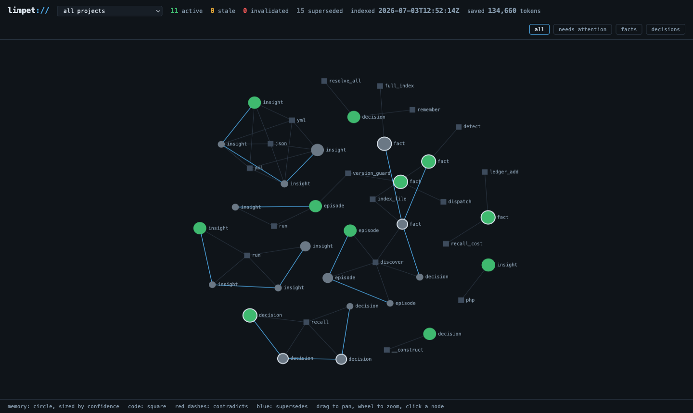

# 🐚 limpet

**small shell. long memory.**

[](https://github.com/KSym04/limpet/actions/workflows/ci.yml)
[](LICENSE)
[](https://rustup.rs)
[](https://github.com/KSym04/limpet/actions/workflows/ci.yml)
[](SECURITY.md)

**Persistent engineering memory for AI coding agents.** AI forgets everything between sessions. limpet remembers what your agent learned about a codebase, and it knows when that knowledge stops being true.

<p align="center">
  
  <br>
  <em>limpet ui: green memories are trustworthy, amber went stale when their code changed, squares are the symbols they clamp onto</em>
</p>

Every coding agent runs the same loop: read code, reason, answer, forget. Next session it pays the full price again. And anything it did write down (session notes, markdown memory files) quietly rots, because nothing connects those notes to the code they describe. limpet replaces that loop with a knowledge lifecycle:

```
read -> reason -> remember -> verify -> flag stale when code changes -> re-verify -> reuse
```

Everything your agent learns about a project (decisions, verified facts, failed approaches, gotchas, intent) is stored as durable memory, anchored to the actual code it describes, and automatically flagged the moment that code changes. Ships as an MCP server, so any MCP-capable agent can use it: one Rust binary, one SQLite file, 100% local.

The principles behind every design decision here, each with the production scar that earned it, live in [PHILOSOPHY.md](PHILOSOPHY.md).

The name is the mechanism: a limpet clamps to one spot and returns to it after every tide. Memories here clamp onto AST-hashed symbols, follow them through renames and file moves, and go visibly stale when the code underneath them actually changes.

## What makes it different (not just another memory store)

Every claim here is checkable in this repo, not marketing:

- **It knows when it is wrong.** Generic AI memory (vector stores, RAG, notes) trusts what it wrote forever. limpet anchors each memory to the code it describes through a normalized AST hash, so a memory flips to `stale` the moment that code is edited, follows it through renames and file moves, and heals if the change is reverted. Self-invalidation is the whole point, and no other open memory layer does it. → [the anchor lifecycle](#-the-anchor-lifecycle)
- **It shows you what it saved.** Every recall is priced against the file reads it replaced and kept in a running ledger you can read: `limpet stats`. The benchmark measures 4.0x fewer tokens on questions an agent re-answers every session, and undercounts on purpose. → [the receipts](#-the-receipts-token-savings-measured)
- **It indexes the whole repository, not just symbols.** Six tree-sitter grammars (PHP, JS, TS, Python, Rust, C/C++) give function- and class-level anchoring; every other file (templates, styles, configs, data, even non-UTF-8 legacy source) is anchorable at the file level. Memories can attach anywhere, and go stale when any of it changes. → [whole repo indexed](#-whole-repo-indexed-thin-on-purpose)
- **It never lies by omission.** Every response carries an honesty envelope: what matched, what was returned, what was dropped and why, how fresh the index is, how much is stale or contradicted. There is no code path that truncates silently, and the benchmark gate has killed limpet's own features when they crossed that line.

It is not a vector database, a code-search engine, or a call-graph oracle; it is the layer that remembers *why*, tied to the code, and tells you when the why no longer holds. See [what limpet is not](#-what-limpet-is-not).

## 🧠 Why this exists

Code indexers answer "what is where" and answer it well. But the expensive knowledge is not in any file:

- why the batch size is 50
- which refactor was tried and rolled back, and what broke
- which method names are frozen because customers hook them
- what that weird cron job actually protects against

Agents re-derive or re-ask this every session, burning tokens, or worse, they guess. And the failure mode that actually kills AI coding assistants is not forgetting; it is remembering something that is no longer true. An agent that still believes last month's version of a function is not unhelpful, it is confidently wrong, and every generic memory store on the market will feed it that lie forever, because in those systems knowledge is written once and trusted forever.

limpet's premise is that a memory about code is only trustworthy while that code still matches it. So knowledge here has a lifecycle, the same one engineers give it:

```
valid -> code changed -> stale (reason attached, confidence drops) -> re-verified or superseded
```

That takes three properties nobody else combines:

1. **Anchored.** Memories attach to symbols through normalized AST body hashes, not line numbers or file paths. Rename a function or move a file and the memory follows. Edit the function body and the memory flips to stale with a reason.
2. **Honest.** Every response carries a metadata envelope: how fresh the index is, how many results matched vs how many were returned, and how much of what you got is stale or contradicted. There is no code path that truncates silently.
3. **Evidenced.** A fact can carry the command that proved it. When its anchor goes stale, limpet hands the agent the exact command to re-verify it.

## 👥 Who is this for

**Solo developers working with an AI agent.** The first session spends tens of thousands of tokens learning your codebase; every session after that, the knowledge is one `recall` away. Survives `/clear`, compaction, and new machines. No re-teaching your own project, and no agent confidently repeating last month's truth about a function you rewrote yesterday.

**Teams.** `admin export` writes `.limpet/memory.jsonl` for git; teammates import after pulling. Onboarding knowledge ("why the batch size is 50", "customers hook these method names, they are frozen") travels with the repo, and unlike a wiki it flags itself when the code moves on. `affected` tells a committer which documented decisions their diff just put at risk.

**Template-heavy and multi-language codebases.** Every file is anchorable, not just symbol-bearing source, so "this layout is locked to 480px by the design system" pins to the actual template or stylesheet and goes stale when someone edits it. On stacks where logic lives in templates, styles, configs, and data files (Rails, Laravel, Django, Vue, any component framework, any CMS theme) that is where most of the knowledge worth keeping lives, and it is exactly what symbol-only indexers cannot reach.

**Open-source maintainers.** `intent` and `decision` memories answer "why is this weird code here" before the PR that "fixes" it lands; `episode` memories stop the third contributor from re-attempting the refactor that already broke things twice.

**Agent builders.** A model-agnostic memory backend behind a standard MCP interface: one binary, zero network calls, inspectable SQLite. Nothing to explain to a security review.

**Who should skip it:** throwaway scripts, repos you touch once, teams that do not use AI agents. Memory pays off only when questions repeat.

## 🧰 The six tools

| Tool | What it does |
|---|---|
| `recall` | Task description in, token-budgeted ranked memory pack out. Stale and contradicted items are always flagged, never hidden. |
| `remember` | Store a memory: `fact`, `decision`, `episode`, `insight`, or `intent`. Anchor it to code. Attach evidence to make it verified. `private: true` keeps a memory local (recalled here, withheld from export); `origin` makes writes idempotent for seeding flows. |
| `map` | Structural outline of a file or symbol plus every memory attached to it. For a symbol target it also returns `lineage` (ancestors, descendants, callers) with each edge labeled `unique`/`ambiguous`/`unresolved`. Code and knowledge in one answer. |
| `affected` | What does my uncommitted diff touch: symbols, memories now at risk, and decisions constraining the code being edited. |
| `verify_queue` | Verified facts whose anchored code changed, each with the exact command that originally proved it. |
| `admin` | index, status, forget, export / import (guarded), ledger / ledger_reset (the savings receipt). Export reports `private_withheld` so callers know how many memories stayed local. |

Every response is wrapped in the honesty envelope:

```json
{
  "data": [ ... ],
  "meta": {
    "freshness": { "indexed_at": "2026-07-03T10:12:44Z", "dirty": 0 },
    "completeness": { "matched": 7, "returned": 3, "omitted_reason": "budget" },
    "staleness": { "stale": 1, "contradicted": 0 }
  }
}
```

## ⚓ The anchor lifecycle

```
code change            anchor resolution         memory becomes
---------------------  ------------------------  -----------------------------
reformat / comments    same normalized AST hash  active (untouched)
rename symbol          body found under new FQN  active, anchor follows
move file              body found in new file    active, anchor follows
edit function body     hash differs at FQN       stale (body_edited), conf drops
delete symbol          body found nowhere        invalidated (kept as history)
duplicate bodies       multiple matches          stale (ambiguous_anchor)
edit anchored file     file content hash differs stale (file_edited), conf drops
delete anchored file   file row gone             invalidated (kept as history)
lose SOME anchors      others still resolve      stale (anchor_lost), never killed
```

A multi-anchor memory dies only when **every** anchor dies. Losing one anchor while others still resolve degrades it to `stale:anchor_lost` so the surviving knowledge stays usable. And `remember` refuses an anchor it cannot resolve, loudly, at write time: no memory is ever born dead.

Staleness is also symmetric: revert the code (a rolled-back experiment, a `git checkout`) and the memory heals back to active on the next call, because the anchor hash matches again. No re-verification ritual for changes that un-happened. The same applies to invalidation: a branch switch, `git stash`, or mid-rebase state that makes files vanish briefly is not a death sentence — when the code comes back and the anchors resolve, the memory recovers. The only final state is `superseded`, which records a deliberate human decision rather than filesystem churn.

Contradictions are explicit links: when a new memory contradicts an old one, both stay visible with the conflict flagged until one `supersedes` the other. History is never silently overwritten.

## 🪙 The receipts: token savings, measured

Persistent memory also happens to be dramatically cheaper than re-derivation. Where the savings come from:

1. **Answers travel as conclusions, not source.** A memory is the 30-token distilled answer; the files it was learned from are thousands of tokens. Reading code to re-derive a known fact pays the full price every single session. Recall pays once per question.
2. **The worst spend is exploration that cannot succeed.** Why a batch size is 50, which refactor was rolled back, which API is frozen: not in any file. Without memory the agent greps, reads, and still does not know, so the tokens bought nothing. With memory these are the cheapest questions of all.
3. **Responses are budget-packed and noise-cut.** `recall` takes a token budget, packs best-first, drops the low-relevance tail, and reports what it omitted. You spend what you allowed, never what happened to match.
4. **No re-teaching after context loss.** Compaction, `/clear`, new session: the knowledge survives outside the context window and comes back at recall prices, not re-derivation prices.

Measured with a reproducible benchmark, seeded with 12 memories over a realistic 9-file fixture service, asking 10 questions an agent typically re-answers every session:

```
question                                                   files+grep   recall   ratio  in code?
----------------------------------------------------------------------------------------------------
why is the batch size 50 and why is there a queue at all         1929      367    5.3x  no (answer only in memory)
why does the scanner skip draft products, is that a bug          1630      377    4.3x  no (answer only in memory)
how is the health score computed                                 1630      352    4.6x  yes
why semicolon delimiter and BOM in the csv export                1327      361    3.7x  no (answer only in memory)
where do report files get written and why                        1327      371    3.6x  no (answer only in memory)
how long are download tokens valid                               1023      167    6.1x  yes
has anyone tried streaming the csv export                        1327      369    3.6x  no (answer only in memory)
can I rename check_product in the scanner                        1630      377    4.3x  no (answer only in memory)
what does the nightly cron actually exist for                     803      317    2.5x  no (answer only in memory)
how often does the dashboard poll progress and can I lower it    1072      340    3.2x  no (answer only in memory)
----------------------------------------------------------------------------------------------------
TOTAL                                                           13698     3398    4.0x
```

**4.0x fewer tokens (75% saved) across the benchmark.** Reproduce it yourself:

```bash
cargo build --release
python3 bench/token_savings.py
```

And the number is not just a benchmark: limpet keeps **your own receipt**. Every recall is priced against its file-reading counterfactual with the same methodology, and `limpet stats` (or `admin {op:"ledger"}`, or the UI header) shows session and lifetime savings: tokens saved, reads avoided, recalls gross and distinct. Negative savings are shown, never floored, and anchorless memories count zero baseline, so the figure is a conservative floor, not marketing.

<p align="center">
  
  <br>
  <em>the receipt, live in a Claude Code statusline: active memories and lifetime tokens saved, read straight from the store</em>
</p>

Methodology, stated so the number can be checked rather than believed:

- "Without limpet" cost is the **minimal** file set containing the answer plus a flat 300 tokens for search round trips. Real agents read more than the minimal set, so real savings are higher.
- Tokens are estimated as ceil(bytes/4) on both sides identically.
- 8 of the 10 questions are marked "no" above: their answers exist in **no file at any token price** (decisions, history, tribal knowledge). File reading gets you the code but not the answer. We still charge limpet full price against the file-reading cost instead of claiming infinite savings.
- The script is a regression gate: it exits nonzero if savings drop below 4x.
- Fixture files are 58 to 179 lines. Real source files run several times larger, and the "without" side grows with file size while a recall response does not.

## 🗺️ Visual memory

```bash
limpet ui --port 9748
```

The UI is its own command, separate from the MCP server. `limpet serve` (stdio) is what Claude Code launches for you automatically after `limpet install`; nothing listens on a port until you start `limpet ui` yourself. If http://127.0.0.1:9748 refuses connections, the MCP server is not broken; the UI just is not running.

Open http://127.0.0.1:9748 for a live force-directed view of the knowledge graph: memories sized by confidence and colored by health (green active, amber stale, red invalidated), clamped to the files and symbols they describe, with contradiction and supersession edges drawn. The "needs attention" filter shows exactly what went stale and why, with the re-verify command one click away. Where other tools visualize code structure, limpet visualizes what your agent knows and whether it is still true. Served by the same single binary, bound to 127.0.0.1 only.

## 📦 Install

**One line.** The installer downloads the latest release binary for your platform, verifies its sha256, installs it, and registers it with Claude Code:

macOS / Linux:

```bash
curl -fsSL https://raw.githubusercontent.com/KSym04/limpet/main/install.sh | bash
```

Windows (PowerShell):

```powershell
irm https://raw.githubusercontent.com/KSym04/limpet/main/install.ps1 | iex
```

Then restart Claude Code and type `/limpet` in any project. That is the whole setup. (`LIMPET_INSTALL_DIR` overrides the install location; `LIMPET_VERSION` pins a release tag.)

Prefer not to pipe a script into your shell? Every step below is the manual equivalent. Prebuilt binaries ship for Apple Silicon macOS, x86_64 Linux, and x86_64 Windows on the [latest release](https://github.com/KSym04/limpet/releases/latest); every asset has a published sha256 — verify it before you trust the binary.

**macOS (Apple Silicon)**

```bash
curl -fsSLO https://github.com/KSym04/limpet/releases/latest/download/limpet-aarch64-apple-darwin.tar.gz
curl -fsSLO https://github.com/KSym04/limpet/releases/latest/download/limpet-aarch64-apple-darwin.tar.gz.sha256
shasum -a 256 -c limpet-aarch64-apple-darwin.tar.gz.sha256
tar xzf limpet-aarch64-apple-darwin.tar.gz          # extracts a single `limpet` binary
sudo install -m 755 limpet /usr/local/bin/limpet
limpet install
```

macOS may quarantine a downloaded binary; if it refuses to run, clear the flag with `xattr -d com.apple.quarantine /usr/local/bin/limpet`.

**Linux (x86_64)**

```bash
curl -fsSLO https://github.com/KSym04/limpet/releases/latest/download/limpet-x86_64-unknown-linux-gnu.tar.gz
curl -fsSLO https://github.com/KSym04/limpet/releases/latest/download/limpet-x86_64-unknown-linux-gnu.tar.gz.sha256
sha256sum -c limpet-x86_64-unknown-linux-gnu.tar.gz.sha256
tar xzf limpet-x86_64-unknown-linux-gnu.tar.gz      # extracts a single `limpet` binary
sudo install -m 755 limpet /usr/local/bin/limpet    # or ~/.local/bin if it is on your PATH
limpet install
```

**Windows (x86_64, PowerShell)**

```powershell
Invoke-WebRequest https://github.com/KSym04/limpet/releases/latest/download/limpet-x86_64-pc-windows-msvc.zip -OutFile limpet.zip
Invoke-WebRequest https://github.com/KSym04/limpet/releases/latest/download/limpet-x86_64-pc-windows-msvc.zip.sha256 -OutFile limpet.zip.sha256
# compare the two hashes — they must match
(Get-FileHash limpet.zip -Algorithm SHA256).Hash
Get-Content limpet.zip.sha256
Expand-Archive limpet.zip -DestinationPath "$env:LOCALAPPDATA\limpet"   # extracts limpet.exe
# add the folder to PATH once, then restart the terminal
[Environment]::SetEnvironmentVariable('Path', $env:Path + ";$env:LOCALAPPDATA\limpet", 'User')
limpet install
```

**With Rust** ([rustup.rs](https://rustup.rs)) — the path for Intel macs, ARM Linux, and any platform without a prebuilt binary:

```bash
cargo install limpet
limpet install
```

Restart Claude Code. Done. (`limpet install --dry-run` previews the exact config changes first; `limpet uninstall` reverses them.)

**Update later** with `limpet update`: it fetches the latest release binary for your platform, verifies it against the published sha256, and atomically replaces the running executable. `limpet update --check` reports whether a newer version exists without installing it. This is the only command that touches the network. Restart Claude Code afterward so the MCP server reloads onto the new binary.

## 🚀 Usage in 60 seconds

**1. In any project, type `/limpet`.** It indexes the code, recalls everything already known (stale items flagged), and switches the session to memory-first mode.

**2. Just work.** The agent now stores what it learns as it learns it:

> "The scanner batch size is 50 because shared hosts kill long requests" becomes a `decision`, anchored to the function that uses it.

**3. Next session, in a fresh context, ask anything it ever learned:**

> you: why is the batch size 50?
> agent: (one `recall` call, ~350 tokens) shared hosts kill requests over 30 seconds; the queue exists so a full scan survives across requests.

No file spelunking, no re-explaining your own codebase.

**4. Change the code and memory reacts.** Edit that function and the memory flips to `stale: body_edited` everywhere it appears. Rename or move the function and the memory follows it silently. Nothing ever pretends to be current when it is not.

Everyday commands:

| Command | Does |
|---|---|
| `/limpet` | index + recall + memory-first mode for the session |
| `/limpet status` | counts and anything needing attention |
| `/limpet review` | re-verify stale facts using their stored proof commands |
| `/limpet export` | write `.limpet/memory.jsonl` to commit and share with the team |
| `limpet stats` | the token-savings receipt: session + lifetime, methodology included |
| `limpet doctor` | one-screen setup diagnosis; also runs automatically after install and update |
| `limpet ui` | knowledge graph at http://127.0.0.1:9748, all projects in one view |
| `limpet statusline` | the statusline segment (memories + tokens saved), read-only and instant |
| `limpet hook` | one-line SessionStart brief for Claude Code hooks, read-only |
| `limpet update` | self-update to the latest release, checksum-verified (the only networked command) |

Data lives under `~/.local/share/limpet/`, one SQLite store per repository. Teammates run `limpet import` after pulling the JSONL.

**Statusline on any platform.** `limpet statusline --root <project dir>` prints the shell segment (`| 🐚 13 · ↑32k tokens saved`, with the count hyperlinking to the project's graph when the UI is running) or nothing at all — it opens the store strictly read-only, never writes, and always exits 0, so it can sit in a prompt safely. Because the rendering lives in the binary, the same one-liner works from a bash statusline on macOS/Linux and a PowerShell or cmd statusline on Windows — no sqlite3 CLI, no bash required:

```powershell
# inside a Claude Code statusline.ps1
$limpetSeg = & limpet statusline --root $projectDir
```

The simplest setup is to let Claude Code call the binary directly as its whole statusline — add to `~/.claude/settings.json`:

```json
{
  "statusLine": {
    "type": "command",
    "command": "limpet statusline --root \"$CLAUDE_PROJECT_DIR\""
  }
}
```

Already have a custom statusline? Append the binary's output as one segment — do **not** query `store.db` with `sqlite3` yourself. The per-repo store key scheme changes between versions (it moved from a path hash to a portable git-remote identity in v0.9.0), so a hand-rolled query silently stops matching and the segment just disappears. Only `limpet statusline` tracks the current scheme. Run `limpet doctor` to check how your statusline is wired: it reports `ok` when it delegates to the binary, `warn` when it hand-rolls a store query that will drift, and the exact line to add when nothing is wired.

Toggle it off with `/limpet statusline` (writes `~/.claude/.limpet-statusline-off`; the command honors the flag).

**Auto-recall at session start.** Without any hook, memory-first behavior depends on the agent remembering to type `/limpet`. With a SessionStart hook, every new session in an already-indexed project opens with a one-line brief injected into context — "This project has limpet memory: 13 active memories, 2 stale…" — and the agent recalls before it reads. Add to `~/.claude/settings.json`:

```json
{
  "hooks": {
    "SessionStart": [
      {
        "hooks": [
          { "type": "command", "command": "PATH=\"$HOME/.local/bin:$HOME/.cargo/bin:$PATH\" limpet hook" }
        ]
      }
    ]
  }
}
```

`limpet hook` prints nothing when the project has no store (sessions outside indexed repos stay clean), opens the store strictly read-only, and always exits 0. The explicit PATH prefix matters: hooks run in a non-login shell that often lacks `~/.local/bin` and `~/.cargo/bin`, and a silently-missing binary is exactly the kind of failure this command is designed never to surface. On Windows use `%USERPROFILE%\AppData\Local\Programs\limpet\limpet.exe hook`.

### Seeding a project

`/limpet scan` cold-starts a repository's memory from what already exists. `light` mode (default) harvests merge commits, tags, and the README; `deep` adds all docs, long-body commits, and the assistant's project memory directory. A preflight recall catches any candidates the store already answers, so re-runs only add gaps. The harvest runs in a subagent to keep raw git output and doc dumps out of the main context; only the curated candidate table comes back. You approve candidates in two tiers before anything is written: high-confidence items as a single block (reject-by-exception), borderlines one at a time. Each approved memory is stamped with an `origin` so duplicates are caught on future scans, and private-source items are stored with `private: true` so they are never exported.

## 🌳 Whole repo indexed, thin on purpose

**Every file in the repository is indexed and anchorable.** Files with a shipped grammar (PHP, JavaScript, TypeScript, Python, Rust, C/C++) get full symbol extraction: functions, classes, imports, and name-based call references labeled `syntactic`. Every other file (`.twig`, `.scss`, `.vue`, `.blade.php`, `.erb`, `.md`, `.yml`, configs, anything) gets a file-level node with a content hash, so a memory can anchor to it and go `stale:file_edited` the moment it changes. On template-heavy stacks that is where the knowledge worth remembering actually lives.

Legacy encodings degrade gracefully: a grammar-matched file that is not valid UTF-8 (CP949 or UTF-16 source in an old C++ engine, say) keeps its file-level anchor instead of disappearing from the index. A grammar can only ever upgrade a file, never make it less anchorable.

What the walk skips, deliberately: everything in `.gitignore`, everything in an optional `.limpetignore` (gitignore syntax, works even outside a git repo), `node_modules`/`vendor`/`target`/`dist`/`build`, hidden junk, `*.min.*` assets, and files over 8MB. Source files over 512KB are indexed at file level but never parsed for symbols: the cap protects tree-sitter from generated bundles, and a giant hand-written translation unit stays anchorable instead of vanishing. Those bounds are what keep a large vendored dependency tree with no `.gitignore` from pegging your CPU; use `.limpetignore` to opt out anything else.

There is no LSP, no type inference, and no claim of a publishable call graph: the index exists to give memory anchor points, invalidation, and recall locality. Every shipped grammar has fixture coverage in the test suite; languages are added when they can be tested, not when they pad a number.

Freshness model: every tool call runs a bounded incremental sweep (changed files reparse in milliseconds via tree-sitter). Queries never block on indexing; anything still dirty is listed in the envelope.

## ⚙️ Per-repo config (`.limpet.json`)

An optional `.limpet.json` at the repository root tunes two things. It is a plain, size-bounded lookup table validated against the shipped grammars; a malformed file fails an explicit `index` loudly instead of being silently ignored.

```json
{
  "extensions": { "inc": "cpp", "module": "php" },
  "auto_import": true
}
```

- **`extensions`** maps a filename suffix to one of the shipped grammars (`php`, `js`, `ts`, `py`, `rust`, `cpp`), so template-heavy and legacy stacks get full symbol extraction on extensions the built-in table does not know. The longest matching suffix wins, so a specific `blade.php` overrides a generic `php`.
- **`auto_import`** (default `true`) seeds a brand-new store from a committed `.limpet/memory.jsonl` on the first index, so a teammate who clones the repo gets the shared memory with no extra step. It runs once, only on a fresh store, through the same guarded path as `limpet import`.

**Portable identity.** A repository's store is keyed by its git `origin` remote when it has one, falling back to the canonical path. Move a checkout or re-clone it and the memory follows; two different repositories can no longer collide onto one store. Existing stores migrate automatically on first open, and a store is never mis-claimed: an ambiguous legacy store is left in place rather than reassigned.

## 🔒 Security posture

- **Local by default.** Indexing, recall, memory, and the UI make no network calls, ever: no telemetry, no API keys, no cloud. The one exception is `limpet update`, which you invoke explicitly; it fetches a checksum-verified release binary over HTTPS and sends nothing but a `limpet/<version>` User-Agent. The UI binds 127.0.0.1 and serves one embedded page, GET only.
- **Secrets never persist.** `remember` scans every body and evidence output and refuses to store anything shaped like a credential (cloud access keys, provider tokens, PEM private-key blocks, JWTs), so a secret cannot reach the local store or a shared `.limpet/memory.jsonl`.
- **Private memories stay local.** A memory stored with `private: true` is recalled normally within the project but is never included in `export` output, so sensitive context cannot reach a shared `.limpet/memory.jsonl`.
- **No shell interpolation.** External commands (git only) run with argument arrays; no string ever reaches a shell.
- **Path validation.** Every file path arriving over MCP is checked against the repository root; absolute paths and traversal are rejected at a single choke point.
- **Parameterized SQL only.** No query in the codebase concatenates user input.
- **Malformed input survives.** The JSON-RPC loop answers parse errors and handler panics with JSON-RPC errors and keeps serving.
- `install` edits only its own `mcpServers.limpet` entry and refuses to touch config it does not recognize; `uninstall` reverses exactly that.
- **Import is a guarded path.** A `.limpet/memory.jsonl` pulled from a teammate is untrusted input, so `import` enforces the same rules as `remember`: secrets are rejected (they can never enter the store, even from a peer), bodies are size-capped, confidence is clamped, future-dated entries cannot poison the merge, and imported anchor hashes are re-resolved against your local code so a forged hash cannot fake freshness. Rejected lines are counted, never silently applied.
- **Broken setup? `limpet doctor`.** It checks the binary, the Claude Code registration (including a moved-binary mismatch), the skill file, the store, its version stamp, and the index, printing ok/FAIL per line. It runs automatically after `install` and `update`.

## 🚫 What limpet is not

- Not a generic AI memory store, vector database, or RAG pipeline. No embeddings, no similarity guesswork: anchors are deterministic AST hashes, and staleness is a fact, not a score. Code-unaware memory stores never notice when the code moves on; noticing is limpet's entire premise.
- Not a code search engine. Your agent already has grep.
- Not a call-graph oracle. Call edges are syntactic and labeled as such.
- Not a cloud memory platform. No account, no sync, no server.
- Retrieval quality tracks what gets written: short, specific, anchored memories recall well, and the tool schemas steer agents toward exactly that.

## 🧭 Roadmap

See [ROADMAP.md](ROADMAP.md) for the full plan: portable repo identity, the structural lineage graph, grammar wave 2, and the 1.0 stability contract. One rule governs all of it: a feature ships only if it feeds a receipt (`limpet stats`, the benchmark, rework-avoided) or the honesty envelope.

## ⚖️ Reliance and license

limpet is an aid to judgment, not a substitute for it. Its freshness and
confidence signals are heuristics computed from code structure, not proof:
an "active" memory is limpet's best evidence that stored knowledge still
holds, never a guarantee that it is correct or complete. Verify anything you
would not want to be wrong about before you rely on it, especially in
security-sensitive or production changes. The whole design philosophy is to
surface uncertainty rather than hide it ([PHILOSOPHY.md](PHILOSOPHY.md)), and
that only protects you if you read the flags it gives you.

The software is provided "as is", without warranty of any kind, and the
authors carry no liability for its use, as set out in the license below.

Contributions are welcome and are accepted under the same MIT license as the
project (inbound = outbound): by opening a pull request you agree your
contribution may be distributed under these terms. See
[CONTRIBUTING.md](CONTRIBUTING.md).

## 📄 License

MIT. See [LICENSE](LICENSE). The MIT permission notice includes an explicit
disclaimer of warranty and limitation of liability; those clauses are the
legally operative protection for both users and authors.
